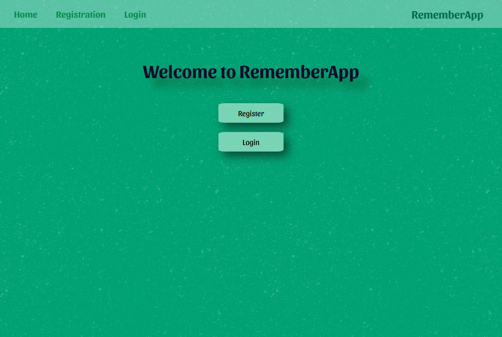
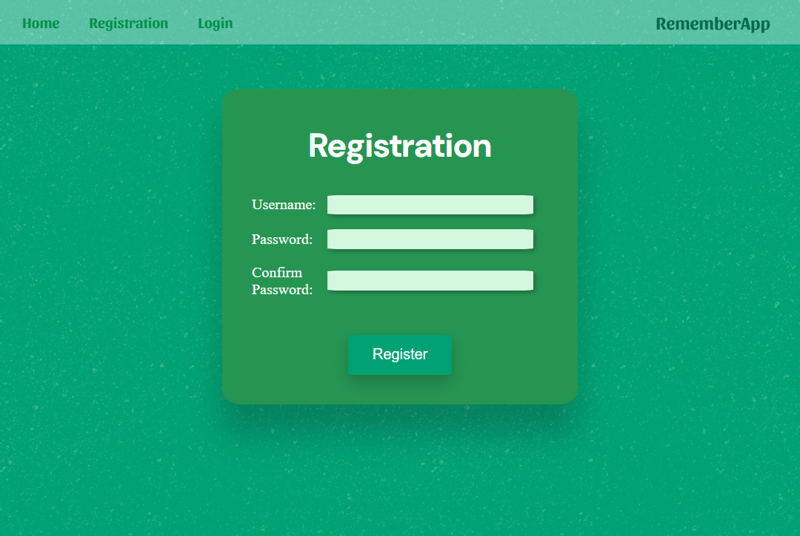
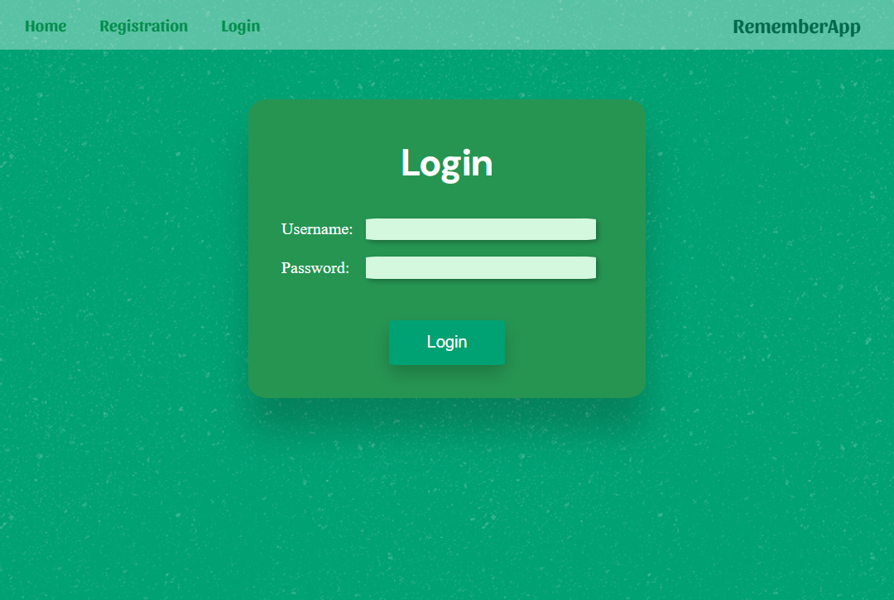
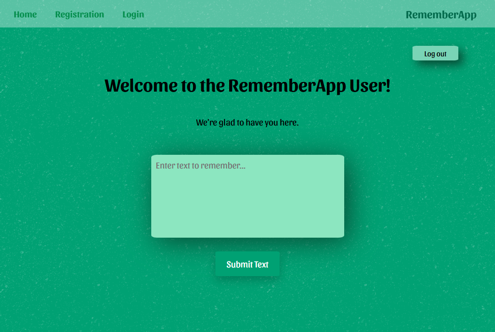

<!-- markdownlint-disable MD033 -->
<!-- markdownlint-disable MD026 -->

# Welcome to *RememberApp*

 

## ✅How *RememberApp* Works

### 1. *Register by entering your username and password, then confirm your password*

### *Or, if you already have an account, you can log in with your username and password*

### 2. *You will then be redirected to the Welcome page, the heart of the application*

 

Here you can write the content you want to save and revisit later. Your credentials are remembered, so if you haven’t logged out, visiting the Login page will automatically redirect you to the Welcome page within 24 hours. Your notes will always be accessible whenever you log in.

  

## 🛑☢️ CAUTION

Do not store sensitive or personal data. This application is for showcase and fun purposes only. Stored data may be preserved for a few days (at least 3 days) and will then be deleted.

 

## 🤓Technical Introduction

<i>This project is built with <b>React.js</b> (using <b>Vite</b> for fast front-end builds) for the front-end and <b>Node.js</b> with <b>Express.js</b> for the back-end. On the front-end, <b>Axios</b> is used to communicate with the server. Passwords are securely hashed with <b>Bcrypt</b> and stored in the database. <b>Express-session</b> and <b>Passport</b> manage sessions and data caching. The app uses <b>PostgreSQL</b> for data storage, implements <b>CRUD</b> operations via a <b>RESTful API</b>.<i>

